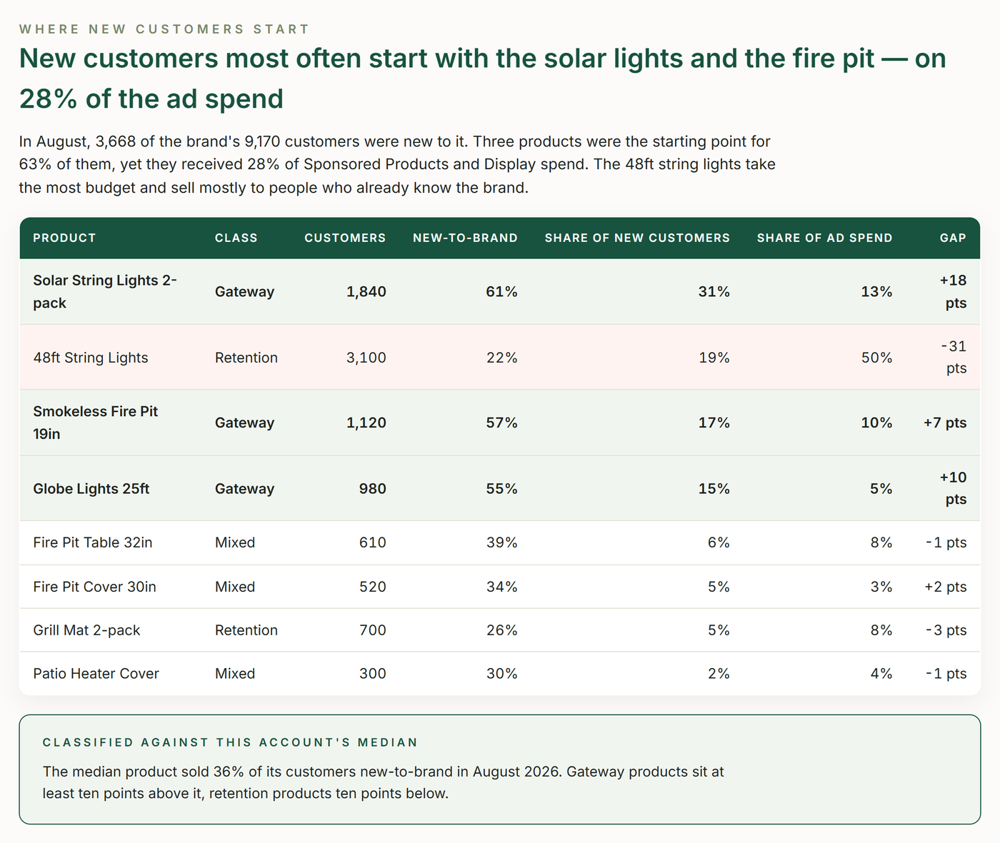

# TrackIQ: Amazon AMC New-to-Brand Products

Answers one question with Amazon Marketing Cloud data: which products do new customers buy first? Those are the gateway products — the ones worth advertising for growth.

Run it monthly, after AMC has settled the previous month.

Part of **Amazon AMC & DSP** in the
[TrackIQ skills catalog](https://github.com/TrackIQ-HQ/amazon-seller-skills).

Built as an [Agent Skill](https://code.claude.com/docs/en/skills). Runs in
Claude Code, Claude web, Claude desktop and ChatGPT from the same folder.

---

## Powered by the TrackIQ MCP

[](https://trackiq.com/mcp)

This skill reads your live Amazon account through the
**[TrackIQ MCP](https://trackiq.com/mcp)** — 16 tools connecting your AI
assistant to Amazon data:

Sales & Traffic · Orders · Inventory · Returns · Sponsored Products · Sponsored
Brands · Sponsored Display · Amazon DSP · AMC Cloud · Keywords · Search Terms ·
Targeting · Search Query Performance · Organic Rank · Best Seller Rank · Buy Box
History · Brand Analytics · Export

Works with Claude, ChatGPT and Cursor. **[Get access →](https://trackiq.com/mcp)**

---

## What you get



Uses Amazon Marketing Cloud to find which products bring new customers into a brand and which mostly sell to people who already buy it — new-to-brand share by ASIN, month by month, the gateway products worth more ad weight, the retention products that need less, and how much Sponsored Products and Display spend each group gets today. Use when the user asks which products bring in new customers, new-to-brand by product or ASIN, gateway or acquisition products, first-purchase products, which ASINs to advertise for growth, or customer acquisition by product.

### The rules that keep it honest

- **Never sum AMC rows across months**
- **A product needs volume to be called a gateway**
- **Classify against the account's own median, not a fixed number**
- **Never say a product caused a new customer**

The full list is in `SKILL.md`, and each one exists because getting it wrong
produces a confident, wrong answer rather than an obvious error.

## Requirements

- The TrackIQ MCP, for `list_marketplaces`, `get_amc_ntb_asins`, `get_product_ads` and `get_product_performance`. - **AMC enabled on the account.** If `get_amc_ntb_asins` returns no rows for the last three complete months, stop and say so — there is nothing to estimate from. - Nothing else. No filesystem or internet needed. - **Without the MCP:** works from an AMC new-to-brand-by-ASIN export plus an advertised-product report.

---

## Install

### Claude Code

```
/plugin marketplace add TrackIQ-HQ/amazon-seller-skills
/plugin install trackiq-amazon-amc-ntb-products@trackiq
```

### Claude web, desktop, mobile

1. Download the `.zip` from the
   [latest release](https://github.com/TrackIQ-HQ/trackiq-amazon-amc-ntb-products/releases)
2. **Settings → Capabilities → Skills** (code execution must be on)
3. **Create skill → Upload a skill**, choose the `.zip`
4. Toggle it on

### ChatGPT

Same zip. **Plugins → Skills → Create → Upload from your computer.**

---

## Setup

Answers live in `account.md`, copied from
[`assets/account.example.md`](skills/trackiq-amazon-amc-ntb-products/assets/account.example.md).
**Every TrackIQ skill reads the same file**, so an account already set up for
another TrackIQ report needs nothing added.

## Delivery

Asked once and stored in `account.md`: **in-chat** (default), **file**,
**Slack**, **n8n** or **email**. Anything leaving the chat confirms with you
first and falls back to in-chat, with a note.

---

## Customizing

| File | What it controls |
|---|---|
| `checks.md` | the pre-send checks |
| `method.md` | the method and every threshold |
| `pulls.md` | the call sequence and its traps |
| `report-template.html` | the report shell |

---

## Contributing

```bash
python scripts/validate.py    # must exit 0 before any commit
python scripts/build.py       # writes dist/ zip + registry.json
```

Read [AUTHORING.md](https://github.com/TrackIQ-HQ/amazon-seller-skills/blob/main/AUTHORING.md)
before proposing changes.

## License

MIT. See [LICENSE](LICENSE).
